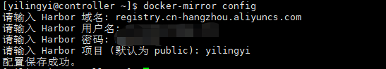
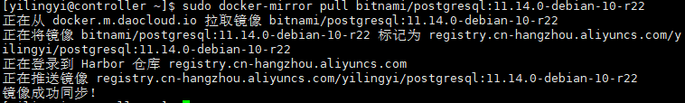
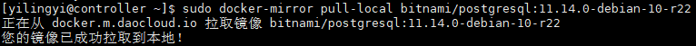

# docker-mirror容器镜像转存工具

## 背景

在dockerHub无法访问后，无疑给运维工作带来了不少麻烦，期间有人问我，我们是怎么应对的？很庆幸的是，我们在问题发生之前，就已经把核心服务的容器镜像转存到本地的Harbor仓库中，在问题发生后只需要更新边缘服务的镜像即可。

从长远考虑，我还是建议企业拥有自己的镜像仓库，把使用到的镜像转存到本地仓库，避免服务再次因镜像拉取不了而无法启动，现在我开源这个工具，可以帮助你快捷完成镜像转存，国内网络也能用。

## 适用仓库

下面两个仓库都适用，已验证

* Harbor
* 阿里云镜像仓库

## 编译

* 二进制文件（已编译好）下载地址

```bash
wget https://github.com/yilingyi/docker-mirror/releases/download/1.1.0/docker-mirror-1.1.0-amd64.tar.gz
```

* 源码编译

```bash
# 下载仓库代码
git clone https://github.com/yilingyi/docker-mirror.git

# 进入仓库目录
cd docker-mirror

# 编译，生成二进制文件
go build -o docker-mirror main.go
```

## 使用说明

* 添加执行权限，并拷贝至`/usr/bin`目录下

```bash
chmod +x docker-mirror && cp docker-mirror /usr/bin
```

* 查看帮助信息

```bash
docker-mirror help
```

* 配置初始化

**Harbor 域名:** 填写仓库域名，可以是harbor或者阿里云镜像仓库

**Harbor 用户名：** 填写账号，具有pull和push权限

**Harbor 密码：** 填写密码

**Harbor 项目：** 填写项目（仓库）名称，默认为public

**示例：** 



* 镜像转存

拉取镜像到本地，在修改镜像名称后转存本地仓库，注意镜像名称不要携带域名

```bash
docker-mirror pull <镜像名称>
```



* 镜像拉取至本地

仅拉取到本地，不上传至harbor仓库，不修改容器镜像名称

```bash
docker-mirror pull-local <镜像名称>
```



* 配置管理

在执行docker-mirror config初始化后，会生成配置文件~/.config/docker-mirror/config.yaml，存储相关信息，其中dockerRegistries支持配置多个加速仓库，也支持配置空值“`dockerRegistries: []`”，不走加速代理。

```bash
harbor:
  domain: registry.cn-hangzhou.aliyuncs.com
  username: ******
  password: ******
  project: yilingyi
dockerRegistries:
- docker.m.daocloud.io
- quay.m.daocloud.io
- k8s.m.daocloud.io
```

## **欢迎订阅我的公众号「SRE运维手记」**
